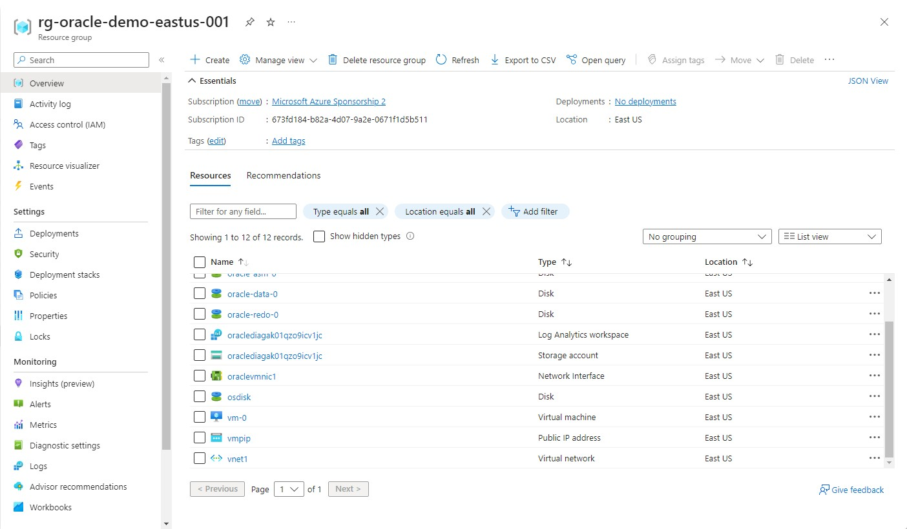
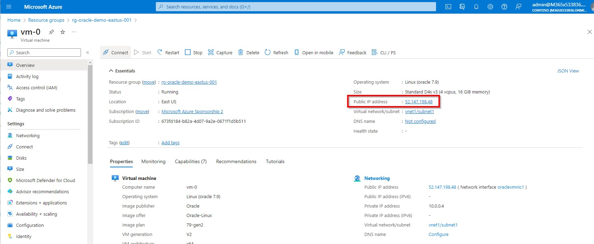

# Review of the infrastrucure provisioned on Azure


1. Once the Azure infrastructure provisioning via terraform is completed, you will see a new Resource Group in your subscription with the following name convention:

```
rg-oracle-demo-eastus-001
``````

2. In the resource group you will find a VM called "vm-01"




3. Copy the public IP address of the VM. An example is given below.




4. Now, you can go back to README.md