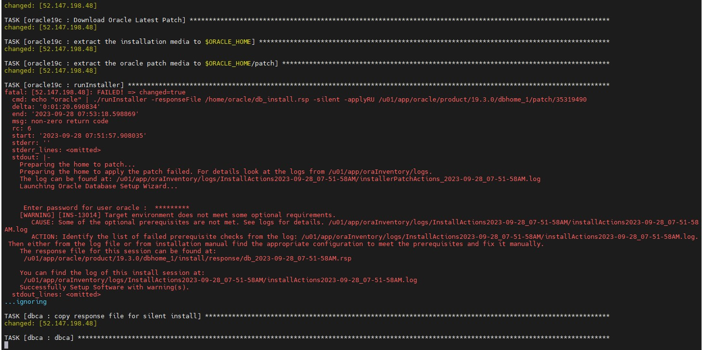
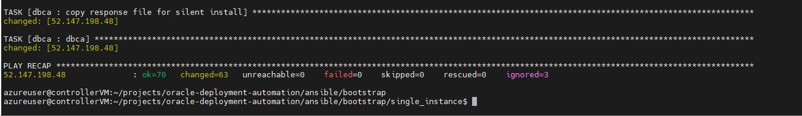

# Using ansible to configure OracleDB & ASM

On the compute source running Ubuntu, follow the steps given below:

1. Switch to the branch subdirectory
```
 $ cd ~/projects/oracle-deployment-automation/ansible/bootstrap/single_instance
```

2. Create a new file called inventory:
```
 $ vi inventory
```

3. The file should contain the following:

```
[dbservers]

<Public IP address of the Azure VM created via terraform>  ansible_ssh_private_key_file=~/.ssh/tf_ora ansible_user=oracle
```

4. Start the ansible playbook
```
$ ansible-playbook playbook.yml -i inventory
```

5. If you get an error stating "ERROR! Invalid callback for stdout specified: community.general.yaml" then run the following step and then re-run the previous step.
```
 $ ansible-galaxy collection install community.general
```

6. It is acceptable to see warnings highlighted in red.



Once the installation and configuration completes, you will see a screen similar to the one below. 




7. Now you can go back to the main README.md file.


