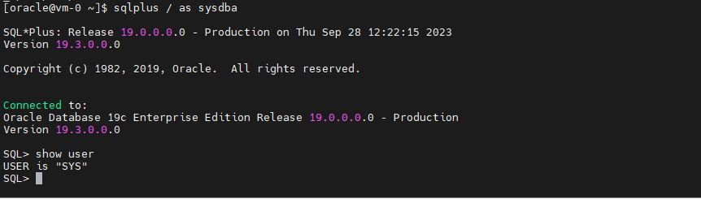

# Testing the final configuration


1. From the compute source, ssh into the Azure VM:
```
$ ssh -i ~/.ssh/tf_ora <public IP address of the Azure VM>
```

2. Check the Oracle related environment variables:
```
$ env | grep -i oracle
```

3. Connect to the database:
```
$ sqlplus / as sysdba
SQL> show user
```




Congatulations. Now, you have a functional Oracle DB running on the Azure VM.